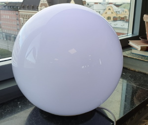

# IoT LightUp
Light up any configured Philips Hue lights to signal an alert when something happens, e.g. a Jira bug is reported or a TeamCity build fails.

An alert scan frequency can be specified for how often to scan for alerts, e.g. in Jira or TeamCity. Defaults to every minute if not specified.

Different schedules can be specified for when to scan for alerts. A blackout property can be set if lights are to be turned off outside of schedule.

LightUp communicates with the Philips Hue lights through a Hue Bridge.

 

## Configuration
The application looks for a "configuration.json" file within a "data" folder.

### Sample configuration

```json
{
  "alertScanFrequency": 60,
  "alertDelay": 300,
  "isBlackoutEnabled": true,
  "ambientLight": 
  {
    "color": "63BBE9",
    "brightness": 50
  },
  "hueBridge": {
    "id": "<bridgeId>",
    "lightNames": "<lightName_1>, <lightName_2>, <lightName_3>"
  },
  "jira": {
    "baseUrl": "<baseUrl>",
    "username": "<username>",
    "token": "<apiToken>",
    "queries": [
      {
        "boardId": "<boardId>",
        "query": "sprint = <sprintId> AND status != Done",
        "alertLight": 
        {
          "color": "FF0000",
          "brightness": 90
        }
      },
      {
        "query": "project = <projectId> AND status != Done",
        "alertLight": 
        {
          "color": "00FF00",
          "brightness": 70
        }
      }
    ]
  },
  "teamcity": {
    "baseUrl": "<baseUrl>",
    "token": "<apiToken>",
    "projects": [
      {
        "id": "<projectId>", 
        "isRecursive": true,
        "excludeBuildConfigIds": "<buildConfigId_1>, <buildConfigId_2>",
        "alertLight": 
        {
          "color": "FFA500",
          "brightness": 90
        }
      }
    ]
  },
  "schedules": [
    {
      "startTimeUtc": "07:00",
      "endTimeUtc": "18:00",
      "days": [
        "Monday",
        "Tuesday",
        "Wednesday",
        "Thursday",
        "Friday"
      ]
    }
  ]
}
```